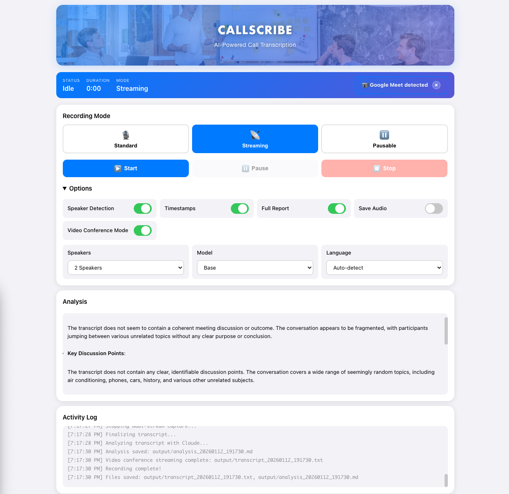

# CallScribe - AI-Powered Call Transcription & Analysis

A standalone Python application that captures system audio or microphone input, transcribes conversations in real-time using OpenAI Whisper, and analyzes transcripts using Claude API.


*Modern Apple-inspired interface with meeting background and cross-device support*

## Features

### Core Features
- Record system audio or microphone input
- Real-time transcription with OpenAI Whisper (local)
- AI-powered analysis with Claude API
- Export transcripts in multiple formats (TXT, Markdown, JSON)
- Timestamp support
- Complete meeting reports with metadata
- Language auto-detection (supports 90+ languages)

### Advanced Features
- **Video Conferencing Support**: Dual-stream recording for Zoom, Meet, Teams, and more
- **Automatic App Detection**: Detects video apps and shows setup instructions
- **Dual-Stream Recording**: Captures both your voice and remote participants simultaneously
- **Streaming Transcription**: Real-time transcription every 5 seconds
- **Pausable Recording**: Interactive pause/resume controls
- **Web GUI**: Modern Apple-inspired browser interface with mobile support
- **Multi-Device Control**: Monitor and control from desktop or mobile
- **Live Analysis Display**: View Claude analysis directly in the web interface
- **QR Code Mobile Access**: Instant connection via QR code scan
- **Automatic Network Detection**: Works on any WiFi network without configuration

### Interface Options
- **CLI**: Command-line interface for terminal users
- **Web GUI**: Browser-based interface with mobile access (default port: 8080)

## Requirements

- Python 3.8+
- macOS, Linux, or Windows
- FFmpeg (required by Whisper)
- Anthropic API key for Claude analysis

## Installation

### 1. Install FFmpeg

**macOS:**
```bash
brew install ffmpeg
```

**Ubuntu/Debian:**
```bash
sudo apt install ffmpeg
```

**Windows:**
Download from [https://ffmpeg.org/](https://ffmpeg.org/)

### 2. Set up Python environment

```bash
# Clone or navigate to the project directory
cd call_transcription

# Create virtual environment
python3 -m venv venv

# Activate virtual environment
source venv/bin/activate  # macOS/Linux
# venv\Scripts\activate   # Windows

# Install dependencies
pip install -r requirements.txt
```

### 3. Configure API Keys

```bash
# Copy example env file
cp .env.example .env

# Edit .env and add your Anthropic API key
# Get your key from: https://console.anthropic.com/
```

Edit `.env`:
```
ANTHROPIC_API_KEY=your_actual_api_key_here
WHISPER_MODEL=base
SAMPLE_RATE=16000
CHANNELS=1
```

### 4. Set up System Audio Capture (macOS)

For capturing system audio on macOS, you need BlackHole:

```bash
# Install BlackHole virtual audio device
brew install blackhole-2ch
```

**Configure Audio:**
1. Open **Audio MIDI Setup** (Applications > Utilities)
2. Click the **+** button and create a "Multi-Output Device"
3. Check both "BlackHole 2ch" and your speakers
4. In CallScribe, use `--list-devices` to find BlackHole's device number

## Usage

### Quick Start - Web GUI (Recommended)

```bash
# Launch web interface
python -m callscribe gui

# Server starts on http://localhost:8080
# QR code displays for mobile access
# Mobile URL auto-detected for your network
```

**What you get:**
- ✅ Modern Apple-inspired UI
- ✅ Desktop and mobile support
- ✅ Real-time status updates and live transcription
- ✅ Three recording modes (Standard, Streaming, Pausable)
- ✅ Point-and-click controls
- ✅ Cross-device state synchronization
- ✅ In-browser analysis display with formatting
- ✅ Language auto-detection support
- ✅ Portable across any WiFi network

**Web GUI Features:**
- **Recording Modes**: Choose Standard, Streaming, or Pausable
- **Options Panel**: Toggle speaker detection, timestamps, Claude analysis, audio saving
- **Language Selection**: Auto-detect or choose from 90+ languages
- **Model Selection**: Choose Whisper model (Tiny, Base, Small, Medium, Large)
- **Live Transcript**: View real-time transcription as it happens
- **Analysis Display**: See Claude analysis with formatted headings, lists, and highlights
- **Activity Log**: Monitor all system activities and progress
- **Mobile QR Code**: Scan to control from your phone
- **Automatic IP Detection**: Works on any network without configuration

See [WEB_GUI_GUIDE.md](WEB_GUI_GUIDE.md) for complete documentation.

### CLI Usage

```bash
# Standard recording
python -m callscribe.main

# Video conferencing mode (dual-stream)
python -m callscribe.main --video-conference

# Detect running video apps
python -m callscribe.main --detect-video-apps

# Streaming mode (real-time transcription)
python -m callscribe.main --streaming

# Pausable mode (interactive pause/resume)
python -m callscribe.main --pausable

# Video conference with analysis
python -m callscribe.main --video-conference --full-report

# List available audio devices
python -m callscribe.main --list-devices

# Use specific audio device
python -m callscribe.main --device 2

# Save audio file
python -m callscribe.main --save-audio

# Include timestamps
python -m callscribe.main --timestamps

# Skip Claude analysis
python -m callscribe.main --skip-analysis

# Generate complete report
python -m callscribe.main --full-report --timestamps

# Auto-detect language
python -m callscribe.main --language auto

# Specify language
python -m callscribe.main --language es  # Spanish
```

### Advanced Options

```bash
# Use different Whisper model
python -m callscribe.main --model medium

# Custom output filename
python -m callscribe.main --output meeting_notes.txt

# Export as Markdown
python -m callscribe.main --format md

# Show current configuration
python -m callscribe.main --show-config
```

## Whisper Models

Available models (speed vs accuracy trade-off):

- `tiny` - Fastest, least accurate (~1GB RAM)
- `base` - Fast, good accuracy (~1GB RAM) **[Recommended for quick prototype]**
- `small` - Balanced (~2GB RAM)
- `medium` - More accurate (~5GB RAM)
- `large` - Most accurate, slowest (~10GB RAM)

**Note:** First run will download the selected model (~140MB for base model).

## Language Support

CallScribe supports 90+ languages with auto-detection:

- **Auto-detect**: Automatically identifies the spoken language
- **Manual selection**: Choose from English, Spanish, French, German, Chinese, Japanese, and many more
- Available in both Web GUI and CLI

## Project Structure

```
callscribe/
├── audio/
│   ├── capture.py              # Standard audio recording
│   ├── streaming_capture.py    # Real-time streaming audio
│   └── pausable_capture.py     # Interactive pausable recording
├── transcription/
│   ├── whisper_client.py       # Whisper integration with language support
│   ├── streaming_transcriber.py # Real-time transcription
│   └── simple_diarization.py   # Free speaker detection
├── analysis/
│   ├── claude_client.py        # Claude API integration
│   └── prompts.py              # Analysis prompts
├── output/
│   └── exporter.py             # File export (TXT, MD, JSON)
├── web/
│   ├── app.py                  # Flask/SocketIO web server
│   ├── gui.py                  # GUI launcher
│   └── templates/
│       ├── index.html          # Modern Apple-inspired UI
│       └── index_old.html      # Original UI (backup)
├── utils/
│   └── config.py               # Configuration management
└── main.py                     # CLI application
```

## Workflow

### Web GUI Workflow
1. **Launch Server**: Run `python -m callscribe gui`
2. **Choose Mode**: Select Standard, Streaming, or Pausable recording
3. **Configure Options**: Toggle features and select language
4. **Start Recording**: Click Start button (syncs across all devices)
5. **Monitor Progress**: View live transcript and status
6. **Stop Recording**: Click Stop button (available on all connected devices)
7. **View Results**: Transcript and analysis appear automatically
8. **Mobile Control**: Scan QR code to control from your phone

### CLI Workflow
1. **Start Recording**: Press ENTER to begin audio capture
2. **Stop Recording**: Press ENTER again to stop (or use pause/resume in pausable mode)
3. **Transcription**: Whisper transcribes the audio locally with language detection
4. **Analysis**: Claude analyzes the transcript for insights
5. **Export**: Saves transcript and analysis to files

## Cost Estimates

**Local Whisper + Claude API:**
- Whisper: FREE (runs locally)
- Claude API: ~$0.01-0.02 per hour of meeting
- **Total: ~$0.01-0.02 per hour**

## Privacy & Legal Notice

**WARNING:** This tool records and transcribes conversations.

- Always get consent from all participants before recording
- Recording laws vary by jurisdiction (two-party vs one-party consent)
- Know your local laws before using this tool
- Store recordings securely and delete when no longer needed
- Transcripts and analyses are saved locally in the `output/` directory

## Troubleshooting

### "No audio recorded"
- Check that the correct audio device is selected
- Test with `--list-devices` to see available devices
- Ensure microphone/system audio permissions are granted

### "ANTHROPIC_API_KEY not found"
- Make sure `.env` file exists in the project root
- Verify API key is correctly set in `.env`
- Activate virtual environment before running

### Whisper model download fails
- Ensure FFmpeg is installed: `ffmpeg -version`
- Check internet connection
- Try smaller model first: `--model tiny`

### System audio not working (macOS)
- Install BlackHole: `brew install blackhole-2ch`
- Configure Multi-Output Device in Audio MIDI Setup
- Select BlackHole device with `--device` flag

### Web GUI not accessible on mobile
- Ensure both devices are on the same WiFi network
- Check firewall settings allow port 8080
- Use the IP address shown in the terminal (not localhost)
- The IP is auto-detected and works on any network

### Server hangs when stopping recording
- Fixed in latest version with improved thread management
- Using `abort()` instead of `stop()` for audio streams
- Early exit from callbacks when stopping

## Example Output

```
Transcript saved to: output/transcript_20240110_143000.txt
Analysis saved to: output/analysis_20240110_143000.md
Audio saved to: output/recording_20240110_143000.wav
```

## Video Conferencing

CallScribe can record Zoom, Google Meet, Microsoft Teams, and other video calls with full transcript of all participants.

### Quick Setup

1. **Install BlackHole:**
   ```bash
   brew install blackhole-2ch
   ```

2. **Create Multi-Output Device:**
   - Open Audio MIDI Setup (Applications > Utilities)
   - Create Multi-Output Device with BlackHole + your speakers

3. **Configure Video App:**
   - Set Speaker to "Multi-Output Device"
   - Keep Microphone as your regular mic

4. **Start Recording:**
   ```bash
   # CLI
   python -m callscribe.main --video-conference

   # Or use Web GUI with "Video Conference Mode" toggle
   python -m callscribe gui
   ```

See **[VIDEO_CONFERENCING_GUIDE.md](VIDEO_CONFERENCING_GUIDE.md)** for complete instructions.

## Documentation

Complete guides for all features:

- **[VIDEO_CONFERENCING_GUIDE.md](VIDEO_CONFERENCING_GUIDE.md)** - Video conferencing setup and usage
- **[WEB_GUI_GUIDE.md](WEB_GUI_GUIDE.md)** - Web interface and mobile access
- **[STREAMING_GUIDE.md](STREAMING_GUIDE.md)** - Real-time streaming transcription
- **[PAUSABLE_GUIDE.md](PAUSABLE_GUIDE.md)** - Pausable recording mode
- **[QUICKSTART.md](QUICKSTART.md)** - Quick setup guide
- **[SETUP.md](SETUP.md)** - Detailed setup instructions
- **[QUICK_REFERENCE.md](QUICK_REFERENCE.md)** - Command reference
- **[PROJECT_SUMMARY.md](PROJECT_SUMMARY.md)** - Project overview

## Features Completed

### Phase 1-3: Core Functionality
- ✅ Audio capture (microphone + system audio)
- ✅ Local Whisper transcription
- ✅ Claude AI analysis
- ✅ Real-time streaming transcription
- ✅ Pause/resume functionality

### Phase 4: Web GUI & Mobile Support
- ✅ Modern Apple-inspired web interface
- ✅ Flask/SocketIO real-time communication
- ✅ Mobile device support with QR code access
- ✅ Multi-device state synchronization
- ✅ Cross-device control (start/stop/pause from any device)
- ✅ Live transcript display
- ✅ Activity log with timestamps
- ✅ Three recording modes (Standard, Streaming, Pausable)
- ✅ Configurable options panel
- ✅ Automatic network IP detection
- ✅ Language auto-detection and selection
- ✅ In-browser analysis display with formatting
- ✅ Responsive design for all screen sizes
- ✅ Compact UI optimized for visibility

### Phase 5: Video Conferencing Support
- ✅ Dual-stream audio capture (mic + system audio)
- ✅ Automatic video app detection (Zoom, Meet, Teams, etc.)
- ✅ BlackHole integration for system audio
- ✅ Video conference mode in Web GUI
- ✅ CLI support for video conferencing
- ✅ App-specific setup instructions
- ✅ Complete video conferencing documentation
- ✅ Separate audio file saving (combined, mic, system)

## Recent Updates

### Version 2.0 - Video Conferencing Support
- **Dual-Stream Recording**: Capture both your voice and remote participants
- **Automatic Detection**: Identifies running Zoom, Meet, Teams, Discord, Slack, Skype
- **BlackHole Integration**: System audio capture on macOS
- **Video Conference Mode**: Toggle in Web GUI, `--video-conference` in CLI
- **Setup Guidance**: App-specific configuration instructions
- **Comprehensive Documentation**: Complete VIDEO_CONFERENCING_GUIDE.md

### UI/UX Improvements
- Redesigned with Apple-inspired aesthetics
- Compact layout fits all elements on screen
- Logo-style header with meeting background
- Reduced font sizes and spacing for better visibility
- Enhanced text shadows and contrast
- Collapsible options panel
- Toggle switches instead of checkboxes
- Video app detection banner in Web GUI

### Technical Improvements
- Fixed streaming mode hanging issue
- Improved thread management for clean shutdowns
- Better error handling in audio callbacks
- Automatic IP detection works on any network
- Analysis content displayed directly in browser
- Markdown formatting for analysis display
- Ctrl+C graceful shutdown
- psutil integration for process detection

### Network Portability
- Dynamic IP detection at runtime
- Works on any WiFi network without configuration
- QR code updates automatically for current network
- Supports home networks, office networks, public WiFi

## License

MIT

## Support

For issues or questions, refer to the documentation files or open an issue on GitHub.

## Contributing

Contributions are welcome! Please ensure all tests pass and documentation is updated.
